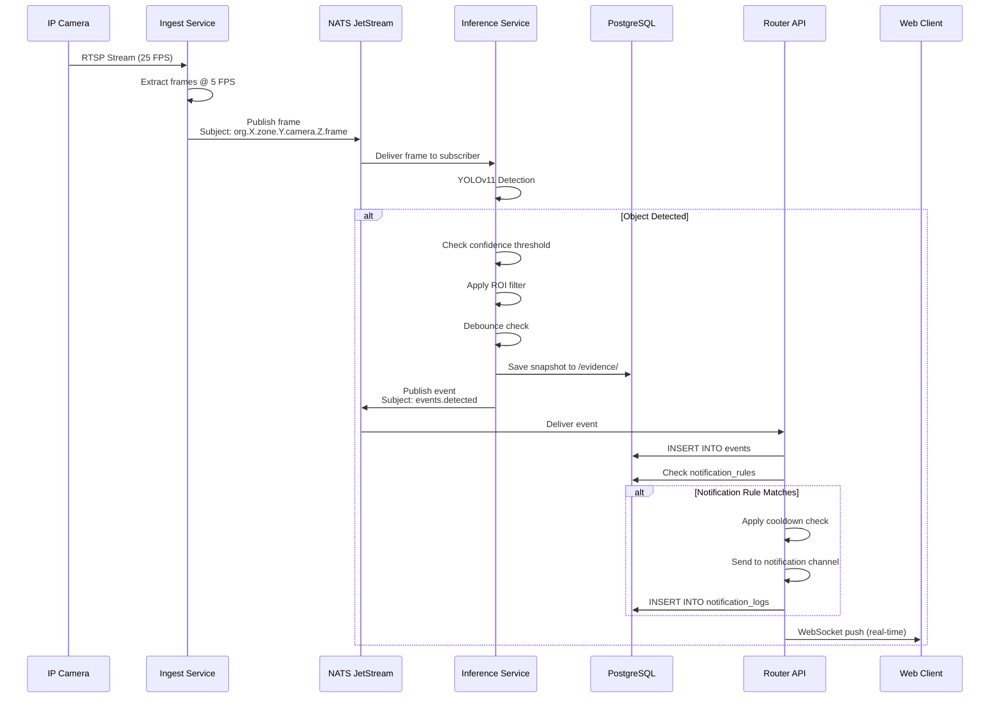
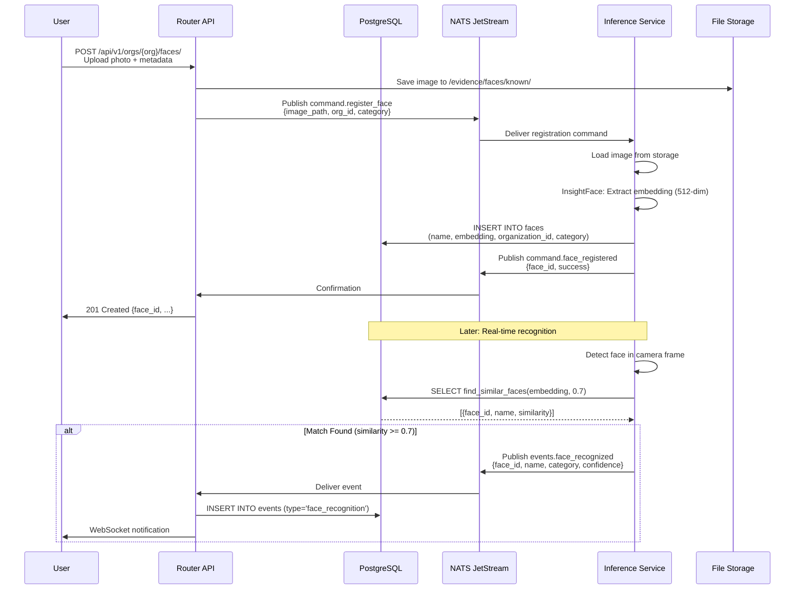
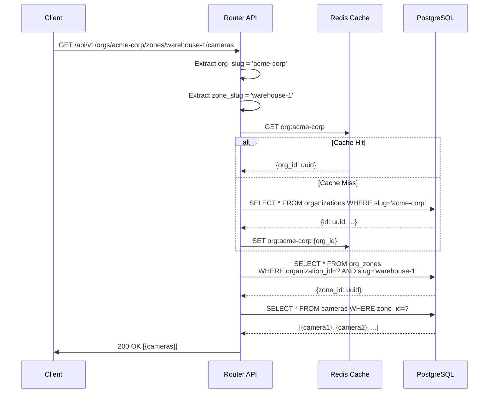
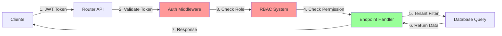
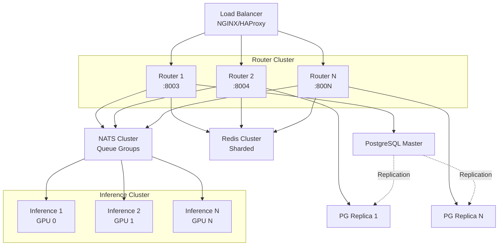

# VIGIAS-IA - ARQUITECTURA DEL SISTEMA

**Última Actualización**: 2025-12-23
**Versión**: 1.3.0-beta
**Stack**: Python 3.13, FastAPI, PyTorch, InsightFace, PostgreSQL, Redis, NATS

---

## 🏗️ ARQUITECTURA GENERAL

```mermaid
graph TB
    %% ========================================
    %% EDGE DEVICES (Hardware)
    %% ========================================

    subgraph EDGE["🎥 EDGE LAYER (Hardware)"]
        CAM1[IP Camera 1<br/>RTSP Stream]
        CAM2[IP Camera 2<br/>RTSP Stream]
        CAM3[IP Camera N<br/>RTSP Stream]
    end

    %% ========================================
    %% INGESTION LAYER
    %% ========================================

    subgraph INGEST["📡 INGESTION LAYER (Go)"]
        INGEST_SVC[Ingest Service<br/>Port 8081<br/>- RTSP Consumer<br/>- Frame Extraction<br/>- NATS Publisher]
    end

    %% ========================================
    %% MESSAGE BUS
    %% ========================================

    subgraph MSGBUS["🚀 MESSAGE BUS"]
        NATS[NATS JetStream<br/>Port 4223<br/>- Subjects:<br/>• camera.*.frame<br/>• org.*.zone.*.camera.*.frame<br/>• events.detected<br/>• commands.*]
    end

    %% ========================================
    %% AI INFERENCE LAYER
    %% ========================================

    subgraph AI["🧠 AI INFERENCE LAYER (Python + CUDA)"]
        INFERENCE[Inference Service<br/>Port 5000<br/>- YOLOv11 Detection<br/>- InsightFace Recognition<br/>- LPR (License Plates)<br/>- Debug Stream (MJPEG)]

        subgraph MODELS["AI Models"]
            YOLO[YOLOv11n<br/>Object Detection]
            FACE[InsightFace buffalo_l<br/>Face Recognition<br/>512-dim embeddings]
            LPR[LPR Model<br/>License Plate Recognition]
        end
    end

    %% ========================================
    %% API GATEWAY
    %% ========================================

    subgraph ROUTER["🌐 API GATEWAY (FastAPI)"]
        ROUTER_SVC[Router Service<br/>Port 8003<br/>- REST API<br/>- WebSocket<br/>- NATS Subscriber<br/>- Cache (L1+L2)]

        subgraph ROUTES["API Routes"]
            ROUTE_ORG[Organizations]
            ROUTE_ZONES[Zones]
            ROUTE_CAMS[Cameras<br/>Management]
            ROUTE_EVENTS[Events/Alarms]
            ROUTE_FACES[Facial<br/>Recognition]
            ROUTE_NOTIF[Notifications<br/>& Rules]
            ROUTE_STREAM[Streaming]
        end
    end

    %% ========================================
    %% CACHING LAYER
    %% ========================================

    subgraph CACHE["⚡ CACHING LAYER"]
        L1[L1 Cache<br/>In-Memory LRU<br/>1000 items, 60s TTL]
        REDIS[Redis<br/>Port 6380<br/>L2 Cache<br/>Rate Limiting<br/>Session Store]
    end

    %% ========================================
    %% DATABASE LAYER
    %% ========================================

    subgraph DB["💾 DATABASE LAYER"]
        POSTGRES[PostgreSQL 14+<br/>Port 5436<br/>- Multi-tenancy<br/>- pgvector extension<br/>- JSONB support]

        subgraph TABLES["Main Tables"]
            TBL_ORG[organizations<br/>org_zones]
            TBL_CAM[cameras<br/>camera_ai_configs]
            TBL_EVENT[events<br/>event_actions]
            TBL_FACE[faces<br/>vector embeddings]
            TBL_NOTIF[notification_channels<br/>notification_rules<br/>notification_logs]
            TBL_AUTH[users<br/>roles<br/>permissions]
        end
    end

    %% ========================================
    %% STORAGE
    %% ========================================

    subgraph STORAGE["📁 FILE STORAGE"]
        EVIDENCE[Evidence Storage<br/>/evidence/<br/>- Snapshots<br/>- Video Clips]
        FACES_IMG[Face Images<br/>/evidence/faces/<br/>- known/<br/>- blacklist/<br/>- unknown/]
    end

    %% ========================================
    %% CLIENT LAYER
    %% ========================================

    subgraph CLIENTS["👥 CLIENT LAYER"]
        WEB[Web Dashboard<br/>React/Angular<br/>Port 4200]
        MOBILE[Mobile App<br/>iOS/Android]
        API_CLIENT[API Clients<br/>Third-party integrations]
    end

    %% ========================================
    %% EXTERNAL SERVICES
    %% ========================================

    subgraph EXTERNAL["🌍 EXTERNAL SERVICES"]
        EMAIL[Email Server<br/>SMTP]
        SMS[SMS Gateway<br/>Twilio/etc]
        SLACK[Slack<br/>Webhooks]
        TELEGRAM[Telegram<br/>Bot API]
        WEBHOOK[Custom<br/>Webhooks]
    end

    %% ========================================
    %% CONNECTIONS
    %% ========================================

    %% Edge to Ingest
    CAM1 -->|RTSP| INGEST_SVC
    CAM2 -->|RTSP| INGEST_SVC
    CAM3 -->|RTSP| INGEST_SVC

    %% Ingest to NATS
    INGEST_SVC -->|Publish Frames| NATS

    %% NATS to Inference
    NATS -->|Subscribe camera.*.frame| INFERENCE

    %% Inference to Models
    INFERENCE --> YOLO
    INFERENCE --> FACE
    INFERENCE --> LPR

    %% Inference back to NATS
    INFERENCE -->|Publish events.detected| NATS

    %% NATS to Router
    NATS -->|Subscribe events.*| ROUTER_SVC

    %% Router to Cache
    ROUTER_SVC <-->|L1 Check| L1
    ROUTER_SVC <-->|L2 Check| REDIS

    %% Router to Database
    ROUTER_SVC <-->|SQL Queries| POSTGRES

    %% Router to Storage
    ROUTER_SVC <-->|Read/Write| EVIDENCE
    ROUTER_SVC <-->|Face Images| FACES_IMG

    %% Router to Routes
    ROUTER_SVC --- ROUTE_ORG
    ROUTER_SVC --- ROUTE_ZONES
    ROUTER_SVC --- ROUTE_CAMS
    ROUTER_SVC --- ROUTE_EVENTS
    ROUTER_SVC --- ROUTE_FACES
    ROUTER_SVC --- ROUTE_NOTIF
    ROUTER_SVC --- ROUTE_STREAM

    %% Clients to Router
    WEB -->|HTTP/WS| ROUTER_SVC
    MOBILE -->|HTTP/WS| ROUTER_SVC
    API_CLIENT -->|REST API| ROUTER_SVC

    %% Router to External Services
    ROUTER_SVC -->|Send Notifications| EMAIL
    ROUTER_SVC -->|Send Alerts| SMS
    ROUTER_SVC -->|Post Messages| SLACK
    ROUTER_SVC -->|Send Messages| TELEGRAM
    ROUTER_SVC -->|HTTP POST| WEBHOOK

    %% Database to Tables
    POSTGRES --- TBL_ORG
    POSTGRES --- TBL_CAM
    POSTGRES --- TBL_EVENT
    POSTGRES --- TBL_FACE
    POSTGRES --- TBL_NOTIF
    POSTGRES --- TBL_AUTH

    %% Inference to Router (debug stream)
    INFERENCE -.->|Debug Stream :5000| WEB

    %% Styling
    classDef hardware fill:#ff9999,stroke:#cc0000,stroke-width:3px
    classDef service fill:#99ccff,stroke:#0066cc,stroke-width:2px
    classDef database fill:#99ff99,stroke:#00cc00,stroke-width:2px
    classDef storage fill:#ffcc99,stroke:#ff6600,stroke-width:2px
    classDef external fill:#cc99ff,stroke:#6600cc,stroke-width:2px
    classDef client fill:#ffff99,stroke:#cccc00,stroke-width:2px

    class CAM1,CAM2,CAM3 hardware
    class INGEST_SVC,ROUTER_SVC,INFERENCE,NATS,REDIS service
    class POSTGRES database
    class EVIDENCE,FACES_IMG storage
    class EMAIL,SMS,SLACK,TELEGRAM,WEBHOOK external
    class WEB,MOBILE,API_CLIENT client
```

---

## 🔄 FLUJO DE DATOS DETALLADO

### 1. Detección de Eventos (Event Detection Flow)



### 2. Reconocimiento Facial (Facial Recognition Flow)



### 3. Multi-Tenancy Request Flow



---

## 🖥️ COMPONENTES DE HARDWARE

### Servidor Principal (Recomendado)

| Componente | Especificación Recomendada |
|------------|----------------------------|
| **CPU** | Intel Xeon / AMD Ryzen 9 (16+ cores) |
| **RAM** | 64 GB DDR4 mínimo |
| **GPU** | NVIDIA RTX 4090 / A6000 (24GB VRAM) |
| **Storage** | 2TB NVMe SSD (sistema + BD) + 10TB HDD (evidencias) |
| **Network** | 10 Gbps NIC (para múltiples streams) |
| **OS** | Ubuntu 22.04 LTS / 24.04 LTS |

### Cámaras IP (Edge Devices)

| Característica | Especificación |
|----------------|----------------|
| **Resolución** | 1080p mínimo (1920x1080) |
| **FPS** | 25-30 FPS |
| **Protocolo** | RTSP compatible |
| **Compresión** | H.264 / H.265 |
| **Night Vision** | IR LEDs (opcional) |
| **POE** | 802.3af/at (recomendado) |

---

## 🌐 ENDPOINTS API (REST)

### Base URL: `http://<servidor>:8003`

#### 1. Multi-Tenancy Core

| Método | Endpoint | Descripción |
|--------|----------|-------------|
| `GET` | `/api/v1/orgs/` | Listar organizaciones |
| `POST` | `/api/v1/orgs/` | Crear organización |
| `GET` | `/api/v1/orgs/{org_slug}/zones/` | Listar zonas |
| `POST` | `/api/v1/orgs/{org_slug}/zones/` | Crear zona |

#### 2. Camera Management

| Método | Endpoint | Descripción |
|--------|----------|-------------|
| `GET` | `/api/v1/orgs/{org}/zones/{zone}/cameras/` | Listar cámaras |
| `POST` | `/api/v1/orgs/{org}/zones/{zone}/cameras/` | Registrar cámara |
| `GET` | `/api/v1/orgs/{org}/zones/{zone}/cameras/{id}/status` | Ver status |
| `POST` | `/api/v1/orgs/{org}/zones/{zone}/cameras/{id}/restart` | Reiniciar cámara |
| `GET` | `/api/v1/orgs/{org}/zones/{zone}/cameras/{id}/health` | Health check |
| `GET` | `/api/v1/orgs/{org}/zones/{zone}/cameras/{id}/metrics` | Métricas |

#### 3. Events & Alarms

| Método | Endpoint | Descripción |
|--------|----------|-------------|
| `GET` | `/api/v1/orgs/{org}/events/` | Listar eventos |
| `GET` | `/api/v1/orgs/{org}/zones/{zone}/events/` | Eventos por zona |
| `GET` | `/api/v1/events/{id}` | Ver evento |
| `PUT` | `/api/v1/events/{id}/status` | Cambiar estado |
| `POST` | `/api/v1/events/{id}/actions` | Añadir acción |
| `GET` | `/api/v1/events/{id}/snapshot` | Descargar snapshot |
| `GET` | `/api/v1/events/{id}/video` | Descargar video |

#### 4. Facial Recognition

| Método | Endpoint | Descripción |
|--------|----------|-------------|
| `GET` | `/api/v1/orgs/{org}/faces/` | Listar rostros |
| `POST` | `/api/v1/orgs/{org}/faces/` | Registrar rostro |
| `GET` | `/api/v1/orgs/{org}/faces/{id}` | Ver rostro |
| `PUT` | `/api/v1/orgs/{org}/faces/{id}` | Actualizar rostro |
| `DELETE` | `/api/v1/orgs/{org}/faces/{id}` | Eliminar rostro |
| `POST` | `/api/v1/orgs/{org}/faces/search` | Buscar rostro |

#### 5. Notifications & Alerts

| Método | Endpoint | Descripción |
|--------|----------|-------------|
| `GET` | `/api/v1/orgs/{org}/notification-channels/` | Listar canales |
| `POST` | `/api/v1/orgs/{org}/notification-channels/` | Crear canal |
| `POST` | `/api/v1/orgs/{org}/notification-channels/{id}/test` | Test canal |
| `GET` | `/api/v1/orgs/{org}/notification-rules/` | Listar reglas |
| `POST` | `/api/v1/orgs/{org}/notification-rules/` | Crear regla |
| `GET` | `/api/v1/orgs/{org}/notification-logs/` | Ver logs |

#### 6. Admin Endpoints (Provider Only)

| Método | Endpoint | Descripción |
|--------|----------|-------------|
| `POST` | `/api/v1/admin/cameras/{id}/start` | Forzar inicio |
| `POST` | `/api/v1/admin/cameras/{id}/stop` | Forzar parada |
| `PUT` | `/api/v1/admin/cameras/{id}/maintenance-mode` | Modo mantenimiento |
| `POST` | `/api/v1/admin/cameras/bulk-restart` | Reinicio masivo |

#### 7. Health & Monitoring

| Método | Endpoint | Descripción |
|--------|----------|-------------|
| `GET` | `/health` | Health check general |
| `GET` | `/docs` | Swagger UI |
| `GET` | `/redoc` | ReDoc documentation |

#### 8. Streaming & WebSockets

| Protocolo | Endpoint | Descripción |
|-----------|----------|-------------|
| `HTTP` | `http://localhost:5000/debug/{camera_id}/mjpeg` | Debug stream (MJPEG) |
| `WS` | `ws://localhost:8003/ws/notifications/{client_id}` | Real-time events |

---

## 🔌 PUERTOS Y SERVICIOS

| Puerto | Servicio | Protocolo | Descripción |
|--------|----------|-----------|-------------|
| **4223** | NATS | TCP | Message bus (JetStream) |
| **5000** | Inference | HTTP | AI service + debug stream |
| **5436** | PostgreSQL | TCP | Database server |
| **6380** | Redis | TCP | Cache + rate limiting |
| **8003** | Router | HTTP/WS | REST API + WebSocket |
| **8081** | Ingest | HTTP | Frame ingestion service |

---

## 📦 STACK TECNOLÓGICO

### Backend

| Componente | Tecnología | Versión |
|------------|-----------|---------|
| API Framework | FastAPI | Latest |
| ASGI Server | Uvicorn | Latest |
| Event Loop | uvloop | 0.22.1 |
| Database ORM | SQLAlchemy | 2.0+ (async) |
| Database Driver | asyncpg | Latest |
| Message Bus | NATS JetStream | Latest |
| Cache | Redis | 7.0+ |
| WebSockets | FastAPI native | - |

### AI/ML

| Componente | Tecnología | Versión |
|------------|-----------|---------|
| Deep Learning Framework | PyTorch | 2.9.1 |
| Object Detection | YOLOv11 (Ultralytics) | 8.3.240 |
| Face Recognition | InsightFace | 0.7.3 |
| Face Model | buffalo_l | - |
| ONNX Runtime | onnxruntime-gpu | 1.23.2 |
| Computer Vision | OpenCV (headless) | 4.12.0.88 |

### Database

| Componente | Tecnología | Versión |
|------------|-----------|---------|
| RDBMS | PostgreSQL | 14+ |
| Vector Search | pgvector | Latest |
| UUID Extension | uuid-ossp | Latest |

### Infrastructure

| Componente | Tecnología |
|------------|-----------|
| Containerization | Docker + Docker Compose |
| Orchestration | Docker Swarm / Kubernetes (futuro) |
| Monitoring | Prometheus + Grafana (futuro) |
| Logging | ELK Stack (futuro) |

---

## 🔐 SEGURIDAD Y AUTENTICACIÓN

### Niveles de Seguridad (Roadmap)



### Roles Implementados (Pendiente JWT)

1. **PROVIDER_ADMIN**: Acceso total
2. **ORG_ADMIN**: Administrador de organización
3. **OPERATOR**: Operador (gestión eventos/cámaras)
4. **VIEWER**: Solo lectura

---

## 🚀 ESCALABILIDAD

### Escalado Horizontal



---

## 📊 MÉTRICAS DE RENDIMIENTO

### Capacidad Actual (Single Server)

| Métrica | Valor |
|---------|-------|
| Cámaras Simultáneas | 50-100 (depende GPU) |
| Frames Procesados/seg | 500-1000 FPS |
| Latencia API | < 100ms (p95) |
| Throughput API | 10,000 req/s |
| Eventos/día | 1M+ |

### Optimizaciones Implementadas

- ✅ L1 + L2 Caching (In-memory + Redis)
- ✅ Database Connection Pooling
- ✅ Async I/O (uvloop)
- ✅ NATS Queue Groups (load balancing)
- ✅ Batch Processing (inference)
- ✅ Rate Limiting (camera restart)

---

## 🛠️ DEPLOYMENT

### Docker Compose (Development)

```bash
cd /home/logisticos-two/dev/Proyect_Computer_Vision
docker-compose up -d
```

### Servicios Levantados

```
✅ PostgreSQL:  puerto 5436
✅ Redis:       puerto 6380
✅ NATS:        puerto 4223
✅ Router:      puerto 8003
✅ Ingest:      puerto 8081
✅ Inference:   puerto 5000 (Python, fuera de Docker)
```

### Producción (Recomendado)

- Docker Swarm con replicas
- NGINX reverse proxy
- SSL/TLS certificates (Let's Encrypt)
- Monitoring con Prometheus/Grafana
- Backups automáticos de BD

---

**Generado por**: Claude Sonnet 4.5
**Fecha**: 2025-12-23
**Versión**: 1.3.0-beta
