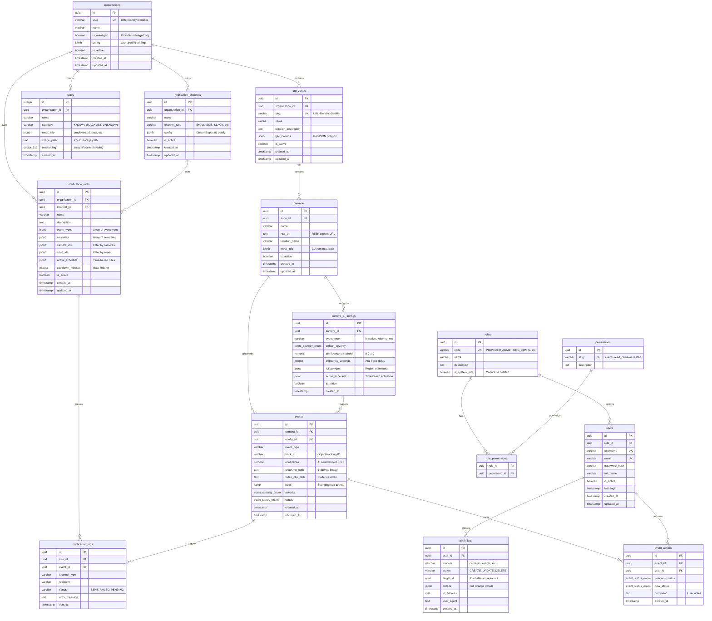

# VIGIAS-IA - DATABASE SCHEMA

**Última Actualización**: 2025-12-23
**Versión**: 1.3.0
**Motor**: PostgreSQL 14+ con extensiones `uuid-ossp` y `vector`

---

## 📊 DIAGRAMA ENTIDAD-RELACIÓN (Mermaid)



---

## 📋 TABLAS DETALLADAS

### 1. MULTI-TENANCY CORE

#### **organizations**
Tabla raíz de multi-tenancy. Cada cliente es una organización.

| Columna | Tipo | Descripción |
|---------|------|-------------|
| `id` | uuid | Primary key |
| `slug` | varchar(100) | URL-friendly ID (ej: `acme-corp`) |
| `name` | varchar(200) | Nombre visible (ej: `ACME Corporation`) |
| `is_managed` | boolean | TRUE si el proveedor gestiona esta org |
| `config` | jsonb | Configuración específica de la org |
| `is_active` | boolean | Soft delete |

**Índices**:
- `UNIQUE` en `slug`
- `INDEX` en `is_active`

---

#### **org_zones**
Zonas geográficas dentro de una organización (ej: Bodega Norte, Piso 3).

| Columna | Tipo | Descripción |
|---------|------|-------------|
| `id` | uuid | Primary key |
| `organization_id` | uuid | FK → organizations |
| `slug` | varchar(100) | URL-friendly ID |
| `name` | varchar(200) | Nombre de la zona |
| `location_description` | text | Descripción textual |
| `geo_bounds` | jsonb | Polígono GeoJSON (opcional) |

**Índices**:
- `UNIQUE` en `(organization_id, slug)`
- `INDEX` en `organization_id`

---

### 2. CAMERA INFRASTRUCTURE

#### **cameras**
Cámaras IP registradas en el sistema.

| Columna | Tipo | Descripción |
|---------|------|-------------|
| `id` | uuid | Primary key |
| `zone_id` | uuid | FK → org_zones |
| `name` | varchar(100) | Nombre descriptivo |
| `rtsp_url` | text | URL de stream RTSP |
| `location_name` | varchar(100) | Ubicación física |
| `meta_info` | jsonb | Metadata custom (marca, modelo, etc) |

**Índices**:
- `INDEX` en `zone_id`
- `INDEX` en `is_active`

---

#### **camera_ai_configs**
Configuración de IA por cámara y tipo de evento.

| Columna | Tipo | Descripción |
|---------|------|-------------|
| `id` | uuid | Primary key |
| `camera_id` | uuid | FK → cameras |
| `event_type` | varchar(50) | `intrusion`, `loitering`, `face_recognition`, etc |
| `default_severity` | enum | `LOW`, `MEDIUM`, `HIGH`, `CRITICAL` |
| `confidence_threshold` | numeric | 0.0 - 1.0 (umbral de confianza AI) |
| `debounce_seconds` | integer | Anti-flood: min segundos entre eventos |
| `roi_polygon` | jsonb | Región de interés (polígono) |
| `active_schedule` | jsonb | Horarios activos (ej: solo noches) |

**Índices**:
- `INDEX` en `(camera_id, event_type)`

---

### 3. EVENTS & ALARMS

#### **events**
Eventos detectados por IA (intrusiones, rostros, etc).

| Columna | Tipo | Descripción |
|---------|------|-------------|
| `id` | uuid | Primary key |
| `camera_id` | uuid | FK → cameras (SET NULL on delete) |
| `config_id` | uuid | FK → camera_ai_configs |
| `event_type` | varchar(50) | Tipo de evento |
| `track_id` | varchar(100) | ID de tracking de objeto |
| `confidence` | numeric | Confianza del modelo IA |
| `snapshot_path` | text | Ruta a imagen de evidencia |
| `video_clip_path` | text | Ruta a video clip |
| `bbox` | jsonb | `{x, y, width, height}` |
| `severity` | enum | Severidad del evento |
| `status` | enum | `PENDING`, `ACKNOWLEDGED`, `RESOLVED`, `FALSE_POSITIVE` |
| `occurred_at` | timestamp | Momento exacto del evento |

**Índices**:
- `INDEX` en `camera_id`
- `INDEX` en `(event_type, status, occurred_at)`
- `INDEX` en `severity`

---

#### **event_actions**
Historial de acciones sobre eventos (cambios de estado, comentarios).

| Columna | Tipo | Descripción |
|---------|------|-------------|
| `id` | uuid | Primary key |
| `event_id` | uuid | FK → events |
| `user_id` | uuid | FK → users |
| `previous_status` | enum | Estado anterior |
| `new_status` | enum | Nuevo estado |
| `comment` | text | Comentario del usuario |

**Índices**:
- `INDEX` en `event_id`

---

### 4. FACIAL RECOGNITION

#### **faces**
Base de datos de rostros conocidos y blacklist.

| Columna | Tipo | Descripción |
|---------|------|-------------|
| `id` | integer | Primary key (serial) |
| `organization_id` | uuid | FK → organizations (multi-tenancy) |
| `name` | varchar(100) | Nombre de la persona |
| `category` | varchar(20) | `KNOWN`, `BLACKLIST`, `UNKNOWN` |
| `meta_info` | jsonb | `{employee_id, department, notes}` |
| `image_path` | text | Ruta a foto original |
| `embedding` | vector(512) | Vector de 512 dimensiones (InsightFace) |

**Índices**:
- `INDEX` en `organization_id`
- `INDEX` en `category`
- `IVFFLAT INDEX` en `embedding` (búsqueda por similaridad)

**Funciones**:
- `find_similar_faces(embedding, threshold, limit, org_id)` - Búsqueda facial

---

### 5. NOTIFICATIONS & ALERTS

#### **notification_channels**
Canales de notificación (Email, Slack, SMS, etc).

| Columna | Tipo | Descripción |
|---------|------|-------------|
| `id` | uuid | Primary key |
| `organization_id` | uuid | FK → organizations |
| `name` | varchar(100) | Nombre descriptivo |
| `channel_type` | varchar(20) | `EMAIL`, `SMS`, `WEBHOOK`, `SLACK`, `TELEGRAM`, `WHATSAPP` |
| `config` | jsonb | Configuración específica del canal |

**Ejemplo config**:
```json
{
  "EMAIL": {"recipients": ["ops@acme.com"], "from": "alerts@vigias.ai"},
  "SLACK": {"webhook_url": "https://...", "channel": "#security"}
}
```

---

#### **notification_rules**
Reglas de cuando enviar notificaciones.

| Columna | Tipo | Descripción |
|---------|------|-------------|
| `id` | uuid | Primary key |
| `organization_id` | uuid | FK → organizations |
| `channel_id` | uuid | FK → notification_channels |
| `name` | varchar(100) | Nombre de la regla |
| `event_types` | jsonb | `["intrusion", "face_recognition"]` |
| `severities` | jsonb | `["HIGH", "CRITICAL"]` |
| `camera_ids` | jsonb | Filtro por cámaras específicas |
| `zone_ids` | jsonb | Filtro por zonas |
| `active_schedule` | jsonb | `{days: [1,2,3,4,5], start: "18:00", end: "08:00"}` |
| `cooldown_minutes` | integer | Rate limit: min minutos entre notificaciones |

**Índices**:
- `INDEX` en `organization_id`
- `INDEX` en `channel_id`

---

#### **notification_logs**
Log de notificaciones enviadas.

| Columna | Tipo | Descripción |
|---------|------|-------------|
| `id` | uuid | Primary key |
| `rule_id` | uuid | FK → notification_rules |
| `event_id` | uuid | FK → events |
| `channel_type` | varchar(20) | Tipo de canal usado |
| `recipient` | varchar(255) | Email/teléfono/webhook |
| `status` | varchar(20) | `SENT`, `FAILED`, `PENDING` |
| `error_message` | text | Mensaje de error si falló |

---

### 6. AUTHENTICATION & AUTHORIZATION

#### **users**
Usuarios del sistema.

| Columna | Tipo | Descripción |
|---------|------|-------------|
| `id` | uuid | Primary key |
| `role_id` | uuid | FK → roles |
| `username` | varchar(50) | Login único |
| `email` | varchar(100) | Email único |
| `password_hash` | varchar(255) | Bcrypt hash |
| `full_name` | varchar(150) | Nombre completo |
| `last_login` | timestamp | Última sesión |

**Índices**:
- `UNIQUE` en `username`
- `UNIQUE` en `email`

---

#### **roles**
Roles del sistema (RBAC).

| Columna | Tipo | Descripción |
|---------|------|-------------|
| `id` | uuid | Primary key |
| `code` | varchar(50) | `PROVIDER_ADMIN`, `ORG_ADMIN`, `OPERATOR`, `VIEWER` |
| `name` | varchar(100) | Nombre legible |
| `is_system_role` | boolean | No se puede eliminar |

**Roles predefinidos**:
- `PROVIDER_ADMIN`: Acceso total
- `ORG_ADMIN`: Admin de su organización
- `OPERATOR`: Operador (gestión de eventos, cámaras)
- `VIEWER`: Solo lectura

---

#### **permissions**
Permisos granulares.

| Columna | Tipo | Descripción |
|---------|------|-------------|
| `id` | uuid | Primary key |
| `slug` | varchar(100) | `events.read`, `cameras.restart`, etc |
| `description` | text | Descripción del permiso |

---

#### **role_permissions**
Tabla pivote: qué permisos tiene cada rol.

| Columna | Tipo | Descripción |
|---------|------|-------------|
| `role_id` | uuid | FK → roles |
| `permission_id` | uuid | FK → permissions |

**Primary Key**: `(role_id, permission_id)`

---

### 7. AUDIT & COMPLIANCE

#### **audit_logs**
Log completo de todas las acciones del sistema.

| Columna | Tipo | Descripción |
|---------|------|-------------|
| `id` | uuid | Primary key |
| `user_id` | uuid | FK → users |
| `module` | varchar(50) | `cameras`, `events`, `users`, etc |
| `action` | varchar(50) | `CREATE`, `UPDATE`, `DELETE`, `LOGIN` |
| `target_id` | uuid | ID del recurso afectado |
| `details` | jsonb | Detalles completos del cambio |
| `ip_address` | inet | IP del cliente |
| `user_agent` | text | User-Agent del cliente |

**Índices**:
- `INDEX` en `user_id`
- `INDEX` en `(module, action, created_at)`

---

## 🔑 ENUMS DEFINIDOS

```sql
-- Severidad de eventos
CREATE TYPE event_severity_enum AS ENUM ('LOW', 'MEDIUM', 'HIGH', 'CRITICAL');

-- Estado de eventos
CREATE TYPE event_status_enum AS ENUM ('PENDING', 'ACKNOWLEDGED', 'RESOLVED', 'FALSE_POSITIVE');
```

---

## 📦 EXTENSIONES POSTGRESQL

```sql
CREATE EXTENSION IF NOT EXISTS "uuid-ossp";  -- Generación de UUIDs
CREATE EXTENSION IF NOT EXISTS vector;        -- pgvector para embeddings
```

---

## 🔍 FUNCIONES UTILITARIAS

### `find_similar_faces()`
Búsqueda de rostros por similaridad coseno.

```sql
SELECT * FROM find_similar_faces(
    query_embedding := '[0.123, 0.456, ...]'::vector(512),
    similarity_threshold := 0.7,
    max_results := 10,
    target_organization_id := 'org-uuid'::uuid
);
```

**Retorna**:
- `face_id`: ID del rostro
- `face_name`: Nombre
- `category`: KNOWN/BLACKLIST
- `similarity`: 0.0 - 1.0
- `organization_id`: Org del rostro

---

## 📈 ÍNDICES OPTIMIZADOS

### Índices de rendimiento crítico:

```sql
-- Búsqueda de eventos recientes por cámara
CREATE INDEX idx_events_camera_occurred
    ON events(camera_id, occurred_at DESC);

-- Búsqueda facial por organización
CREATE INDEX idx_faces_organization
    ON faces(organization_id) WHERE organization_id IS NOT NULL;

-- Búsqueda de similaridad facial (IVFFLAT)
CREATE INDEX idx_faces_embedding_cosine
    ON faces USING ivfflat (embedding vector_cosine_ops)
    WITH (lists = 100);

-- Audit trail por módulo
CREATE INDEX idx_audit_module_created
    ON audit_logs(module, created_at DESC);
```

---

## 🗄️ TAMAÑO ESTIMADO DE DATOS

| Tabla | Filas Estimadas | Tamaño Aprox |
|-------|-----------------|--------------|
| `organizations` | 100 | 50 KB |
| `org_zones` | 500 | 200 KB |
| `cameras` | 5,000 | 5 MB |
| `events` | 10M/año | 10 GB/año |
| `faces` | 100,000 | 50 MB (sin imágenes) |
| `notification_logs` | 5M/año | 5 GB/año |
| `audit_logs` | 50M/año | 20 GB/año |

---

## 🔄 MIGRACIONES APLICADAS

1. **migration_001_initial_schema.sql** - Schema base multi-tenancy
2. **migration_002_faces_notifications.sql** - Sistema de notificaciones y faces multi-tenancy
3. **migration_003_add_face_embeddings.sql** - Vector embeddings para facial recognition

---

## 📝 NOTAS IMPORTANTES

### Soft Deletes
Muchas tablas usan `is_active` en lugar de `DELETE` físico:
- `organizations`, `org_zones`, `cameras`
- `camera_ai_configs`, `notification_channels`, `notification_rules`

### Cascading Deletes
- `organizations` → `org_zones` → `cameras` (CASCADE)
- `cameras` → `camera_ai_configs` (CASCADE)
- `events` → `event_actions` (CASCADE)
- `notification_rules` → `notification_logs` (CASCADE)

### SET NULL
- `events.camera_id` (si se borra cámara, el evento persiste)
- `notification_logs.event_id` (si se borra evento, el log persiste)

---

**Generado por**: Claude Sonnet 4.5
**Fecha**: 2025-12-23
**Versión del Esquema**: 1.3.0
