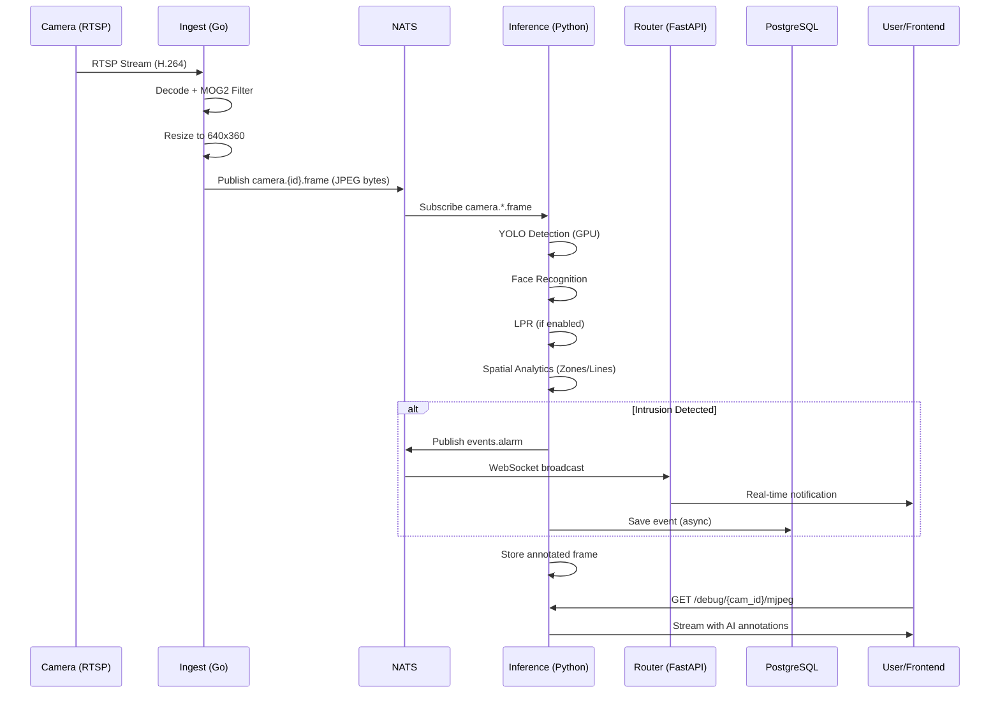
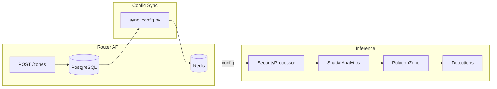

# VIGIAS-IA System Architecture

## 🔍 Overview

This document explains how the VIGIAS-IA computer vision system works, including camera consumption, GPU/YOLO usage, and available API endpoints.

---

## 📐 System Architecture Diagram

```mermaid
flowchart TB
    subgraph Cameras["📹 Hikvision Cameras"]
        CAM1[cam_701]
        CAM2[cam_1001]
        CAM3[cam_1301]
        CAM4[cam_2201]
        CAM5[cam_2701]
    end

    subgraph Docker["🐳 Docker Services"]
        subgraph Ingest["Ingest Service :8081"]
            RTSP[RTSP Reader]
            MOG2[MOG2 Motion Filter]
            ENCODE[JPEG Encoder]
        end
        
        NATS["NATS JetStream :4223"]
        REDIS["Redis Cache :6380"]
        POSTGRES["PostgreSQL :5436"]
        
        subgraph Router["Router API :8003"]
            API[FastAPI Endpoints]
            WS[WebSocket /ws]
        end
    end
    
    subgraph Inference["🤖 Inference Service :5000"]
        YOLO["YOLO (GPU/CUDA)"]
        FACE["InsightFace"]
        LPR["LPR Model"]
        SPATIAL["Spatial Analytics"]
        STREAM["MJPEG Stream"]
    end

    CAM1 & CAM2 & CAM3 & CAM4 & CAM5 -->|RTSP| RTSP
    RTSP --> MOG2 --> ENCODE
    ENCODE -->|camera.{id}.frame| NATS
    
    %% CORRECCIÓN AQUÍ: Conectamos NATS al primer nodo del proceso (YOLO) 
    %% en vez del subgráfico (Inference)
    NATS -->|Subscribe| YOLO
    
    YOLO --> FACE --> LPR --> SPATIAL
    SPATIAL -->|Annotated Frame| STREAM
    SPATIAL -->|events.alarm| NATS
    NATS --> WS
    
    %% CORRECCIÓN AQUÍ: Conectamos API (el nodo) en vez de Router (el subgráfico)
    API --> REDIS
    API --> POSTGRES
```

---

## 📡 Data Flow (Detailed)



---

## 🎯 GPU/YOLO Usage

| Component | GPU Usage | Details |
|-----------|-----------|---------|
| **YOLO Model** | ✅ **CUDA** | `self.model.to('cuda')` - Runs on GPU |
| **Inference** | ✅ **FP16** | Half precision for faster inference |
| **InsightFace** | ✅ **CUDAExecutionProvider** | Face embeddings on GPU |
| **LPR Model** | ✅ **CUDA** | License plate detection on GPU |

### YOLO Configuration

```python
# From inference/models/yolo.py
self.model = pt_model.to('cuda')  # Load on GPU

# Inference with FP16
return self.model(frame_or_batch, verbose=False, device=0, half=True, conf=conf)
```

---

## 🔲 Zone API (Polygon ROI)

### ✅ Confirmed: `POST /api/v1/cameras/{camera_id}/zones`

This endpoint accepts polygon coordinates via the `roi_polygon` field.

### Request Schema

```json
{
  "event_type": "intrusion",           // intrusion, loitering, line_crossing, etc.
  "roi_polygon": [                     // Normalized coordinates (0.0-1.0)
    [0.1, 0.2],
    [0.9, 0.2],
    [0.9, 0.8],
    [0.1, 0.8]
  ],
  "confidence_threshold": 0.5,
  "debounce_seconds": 5,
  "default_severity": "HIGH"           // CRITICAL, HIGH, MEDIUM, LOW, INFO
}
```

### Validation Rules

| Rule | Description |
|------|-------------|
| Minimum 3 points | Polygon must have at least 3 vertices |
| Normalized coords | Each point must be `[x, y]` where `0.0 ≤ x,y ≤ 1.0` |
| Unique event_type | Only one zone per camera per event type |

### Zone CRUD Endpoints

| Method | Endpoint | Description |
|--------|----------|-------------|
| `GET` | `/api/v1/cameras/{camera_id}/zones` | List all zones |
| `POST` | `/api/v1/cameras/{camera_id}/zones` | **Create zone (with polygon)** |
| `PUT` | `/api/v1/cameras/{camera_id}/zones/{zone_id}` | Update zone |
| `DELETE` | `/api/v1/cameras/{camera_id}/zones/{zone_id}` | Delete zone |

---

## 🌐 All API Endpoints

### Router Service (:8003)

| Endpoint | Method | Description |
|----------|--------|-------------|
| `/health` | GET | Health check |
| `/api/v1/cameras` | GET/POST | Camera CRUD |
| `/api/v1/cameras/{id}/zones` | GET/POST | **Zone with polygon** |
| `/api/v1/cameras/{id}/zones/{zid}` | PUT/DELETE | Zone management |
| `/api/v1/alarms` | GET | Alarm history |
| `/api/v1/stream/{id}/mjpeg` | GET | Raw stream (via Ingest) |
| `/api/v1/stream/{id}/annotated` | GET | AI stream (via Inference) |
| `/ws` | WebSocket | Real-time alarms |

### Inference Service (:5000)

| Endpoint | Method | Description |
|----------|--------|-------------|
| `/debug/{camera_id}/mjpeg` | GET | Stream with AI annotations |

### Ingest Service (:8081)

| Endpoint | Method | Description |
|----------|--------|-------------|
| `/stream/{camera_id}` | GET | Raw MJPEG stream |
| `/snapshot/{camera_id}` | GET | Single frame snapshot |

---

## 🔄 How Zones are Applied



### Processing Flow

1. **User creates zone** via `POST /api/v1/cameras/{id}/zones`
2. **Zone saved** to PostgreSQL with `roi_polygon` field
3. **sync_config.py** reads DB and updates Redis
4. **Inference** reads config from Redis every 5 seconds
5. **SpatialAnalytics.set_polygon_zone()** creates supervision `PolygonZone`
6. **YOLO detections** are checked against polygon
7. **If intrusion detected** → alarm published via NATS

---

## 📊 Current System Status

| Service | Port | Status |
|---------|------|--------|
| NATS | 4223 | ✅ Running |
| Redis | 6380 | ✅ Running |
| PostgreSQL | 5436 | ✅ Running |
| Router | 8003 | ✅ Running |
| Ingest | 8081 | ✅ 5 cameras connected |
| Inference | 5000 | ✅ GPU Active |

### Camera Streams (AI Annotated)

- http://localhost:5000/debug/cam_701/mjpeg
- http://localhost:5000/debug/cam_1001/mjpeg
- http://localhost:5000/debug/cam_1301/mjpeg
- http://localhost:5000/debug/cam_2201/mjpeg
- http://localhost:5000/debug/cam_2701/mjpeg
