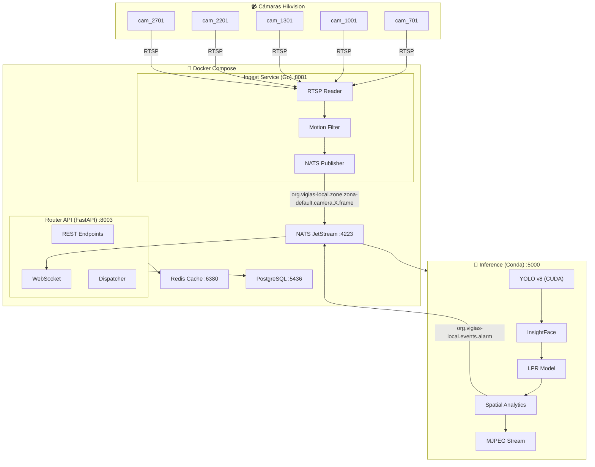
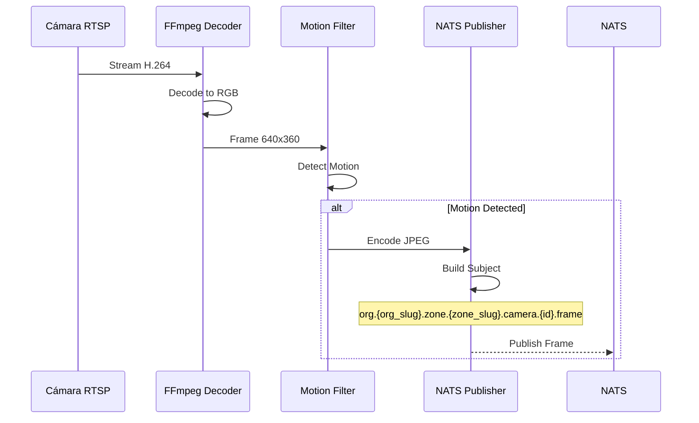
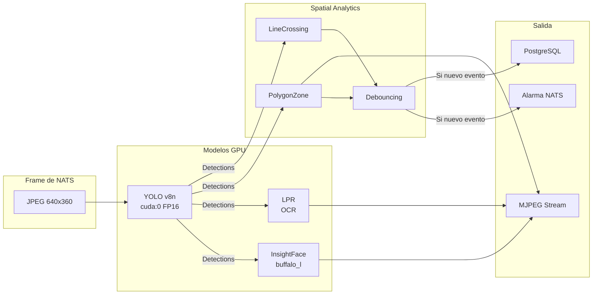
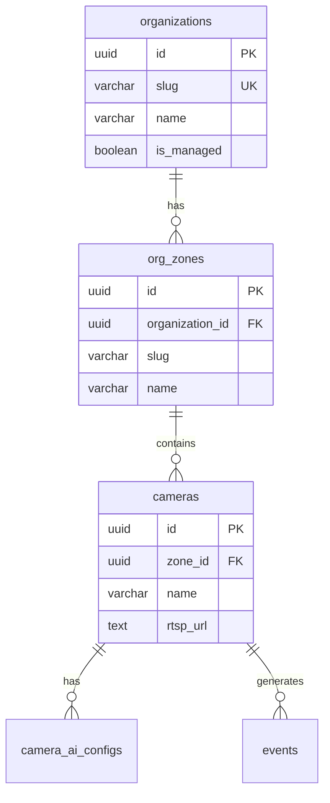
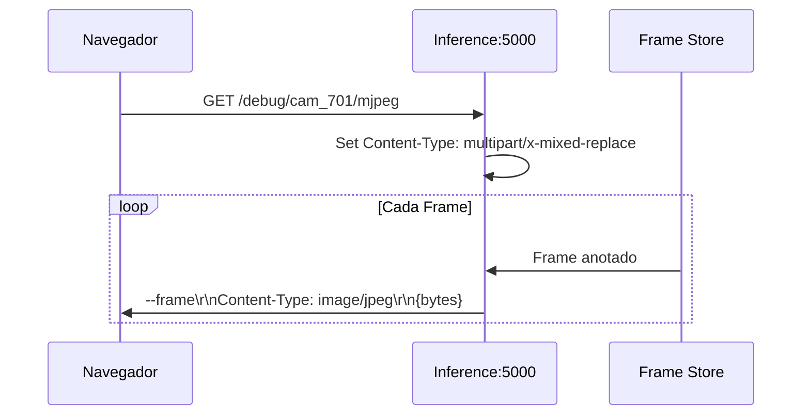

# VIGIAS-IA System Walkthrough

## 📌 Sistema con Multi-Tenancy

Este documento explica en detalle cómo funciona el sistema VIGIAS-IA después de la implementación de multi-tenancy.

---

## 🏗️ Arquitectura General



---

## 📡 Flujo de Datos Paso a Paso

### 1️⃣ Ingesta de Video (Ingest Service)

**Ubicación:** `/home/logisticos-two/dev/Proyect_Computer_Vision/ingest/`

**Tecnología:** Go (compilado en Docker)



**Configuración:** `cameras.json`
```json
{
  "id": "cam_701",
  "org_slug": "vigias-local",    // ← Multi-tenancy
  "zone_slug": "zona-default",   // ← Multi-tenancy
  "url": "rtsp://{USER}:{PASS}@{IP}:{PORT_RTSP}/Streaming/Channels/701"
}
```

---

### 2️⃣ Mensajería (NATS)

**Puerto:** 4223

**Subjects Multi-Tenancy:**
| Tipo | Subject Pattern |
|------|-----------------|
| Frames | `org.{org}.zone.{zone}.camera.{id}.frame` |
| Alarms | `org.{org}.events.alarm` |
| Config | `org.{org}.zone.{zone}.camera.{id}.config` |

**Ejemplo Real:**
```
org.vigias-local.zone.zona-default.camera.cam_701.frame
```

---

### 3️⃣ Procesamiento IA (Inference Service)

**Ubicación:** `/home/logisticos-two/dev/Proyect_Computer_Vision/inference/`

**Entorno:** Miniconda3 (`vigias-ia`)

#### Activación del Entorno

```bash
source /home/logisticos-two/dev/miniconda3/bin/activate vigias-ia
```

#### Ejecución

```bash
cd /home/logisticos-two/dev/Proyect_Computer_Vision
python -c "from inference.main import run; import asyncio; asyncio.run(run())"
```

#### Pipeline de Modelos



#### Configuración GPU

```python
# inference/models/yolo.py
self.model = pt_model.to('cuda')  # GPU
result = self.model(frame, half=True)  # FP16
```

---

### 4️⃣ API Backend (Router Service)

**Puerto:** 8003

**Tecnología:** FastAPI + SQLAlchemy Async

#### Endpoints Multi-Tenancy

| Método | Endpoint | Descripción |
|--------|----------|-------------|
| GET | `/api/v1/orgs` | Listar organizaciones |
| POST | `/api/v1/orgs` | Crear organización |
| GET | `/api/v1/orgs/{slug}/zones` | Listar zonas |
| POST | `/api/v1/orgs/{slug}/zones` | Crear zona |
| GET | `/api/v1/cameras` | Listar cámaras (legacy) |
| POST | `/admin/cache/warmup` | Calentar cache Redis |
| GET | `/health` | Health check avanzado |

#### Cache Multi-Tenancy (Redis)

```python
# Nueva clave
config:org:vigias-local:zone:zona-default:camera:cam_701

# Clave legacy (backward compatible)
config:camera:cam_701
```

---

### 5️⃣ Base de Datos (PostgreSQL)

**Puerto:** 5436

#### Tablas Multi-Tenancy



#### Estado Actual

| Tabla | Registros |
|-------|-----------|
| organizations | 2 |
| org_zones | 2 |
| cameras | 2* |
| events | 150+ |

*Nota: Faltan 3 cámaras en BD, existen en cameras.json

---

### 6️⃣ Streaming al Frontend

**Endpoint Inference:** `http://localhost:5000/debug/{camera_id}/mjpeg`



---

## 🔧 Comandos de Operación

### Levantar Sistema Completo

```bash
# 1. Docker (NATS, Redis, Postgres, Router, Ingest)
cd /home/logisticos-two/dev/Proyect_Computer_Vision
docker-compose up -d --build

# 2. Inference (GPU)
nohup bash -c 'source /home/logisticos-two/dev/miniconda3/bin/activate vigias-ia && \
cd /home/logisticos-two/dev/Proyect_Computer_Vision && \
python -c "from inference.main import run; import asyncio; asyncio.run(run())"' \
> /tmp/inference.log 2>&1 &
```

### Health Check

```bash
# Router
curl http://localhost:8003/health

# Inference
curl -s http://localhost:5000/debug/cam_701/mjpeg -o /dev/null -w "%{http_code}"
```

### Cache Warmup

```bash
curl -X POST http://localhost:8003/admin/cache/warmup
```

---

## 📊 Resumen de Puertos

| Puerto | Servicio | Stack |
|--------|----------|-------|
| 4223 | NATS | Docker |
| 5436 | PostgreSQL | Docker |
| 6380 | Redis | Docker |
| 8003 | Router API | Docker (FastAPI) |
| 8081 | Ingest | Docker (Go) |
| 5000 | Inference | Conda (Python+CUDA) |

---

## 🔗 URLs de Streams

| Cámara | URL Stream con IA |
|--------|-------------------|
| cam_701 | http://localhost:5000/debug/cam_701/mjpeg |
| cam_1001 | http://localhost:5000/debug/cam_1001/mjpeg |
| cam_1301 | http://localhost:5000/debug/cam_1301/mjpeg |
| cam_2201 | http://localhost:5000/debug/cam_2201/mjpeg |
| cam_2701 | http://localhost:5000/debug/cam_2701/mjpeg |
